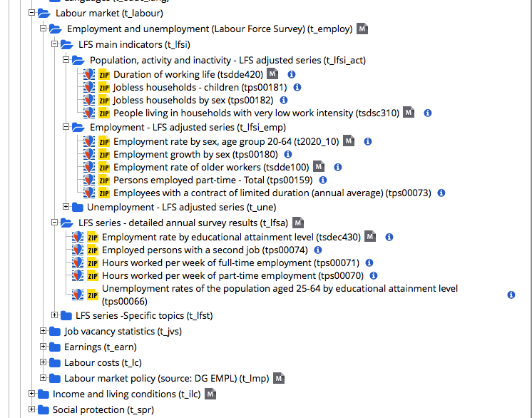

```{r setup, include=FALSE}
knitr::opts_chunk$set(echo = TRUE)
```

## Objectives:

* 1. Get familiar with the eurostat package (functions and data)

* 2. Explore employment over time for all the EU Countries. Highlight how things are developing in Portugal and for Females.

* 3. Plan to make data accessible in the easiest way, just using functions in the eurostat package and Shiny

## 1. Get familiar with eurostat package

```{r, eval = FALSE, echo = FALSE}
# Install package latest developments
#install.packages("eurostat")
library(devtools)
install_github("ropengov/eurostat")
```


Load libraries
```{r, message = FALSE}
library(eurostat)
library(rvest)
library(tidyverse)
library(stringr)
library(purrr)
library(ggthemes)
library(sf) #to convert objects for map visualizations
library(tmap)
```

List of the package functions
```{r, eval = FALSE, echo = FALSE}
cat(str_c(library(help = "eurostat")$info[[2]], collapse = "\n"))
```

**Find Data**

Check out the table of contents
```{r}
eurostat_data <- get_eurostat_toc()
head(eurostat_data, 3)
```

Use eurostat functions to find data with the keywords 'employment' and 'gender'
```{r, echo = FALSE, eval = FALSE}
# search by Gender
search_eurostat("Gender", type = "table") %>% head(3)
```

Find data with `search_eurostat()` function
```{r}
# Get gender employment gap code to download the data
gender_gap <- search_eurostat("Gender", type = "table")$code[7]
```

Find and get the same data with `dplyr` and `stringr`:
```{r}
# search first by 'employment' keyword
gender_query <- search_eurostat("employment", type = "table") %>% #62 observations
        # get gender data 
        filter(str_detect(title, "^[Gender]")) %>%  #3 observations
        # get the first 
        head(1) %>% 
        select(code)
```

`gender_gap`and `gender_query` hold the same result but have different names to show how to find data in different ways.

Find data by searching on the [table of contents]("http://ec.europa.eu/eurostat/data/database"): 
"Employment rates by sex, age and educational attainment level (%)"
```{r, echo = FALSE, eval = FALSE}
# Find data by the corresponding code
employ_explore <- eurostat_data %>% 
        filter(code == "lfsa_ergaed") 
```

```{r}
# attribute the code of interest to a variable for later use
employ_query <- "lfsa_ergaed"
```

**Download and read data** 

Gender employment gap data 
```{r, message = FALSE, warning = FALSE}
gender_dat <- get_eurostat(gender_query, time_format = "num") #time_format = raw converts time variable to character
knitr::kable(head(gender_dat))
```

Employment rates by sex, age and educational attainment level (%) data
```{r, message = FALSE, warning = FALSE}
employ_dat <- get_eurostat(employ_query, time_format = "num")
knitr::kable(head(employ_dat))
```
**Explore data**

```{r, eval = FALSE}
# Gender data structure
str(gender_dat)
levels(gender_dat$geo) 
levels(gender_dat$indic_em)
```
```{r}
# Employment by sex, age... structure
str(employ_dat)
levels(employ_dat$geo)
levels(employ_dat$isced11)
```


Get human-readable labels
```{r}
# employment gender gap data
head(label_eurostat(gender_dat)) # label observations
head(label_eurostat_vars(names(gender_dat))) # label variables
```

```{r}
# employment data by sex
head(label_eurostat(employ_dat))
head(label_eurostat_vars(names(employ_dat)))
employ_labeled <- label_eurostat(employ_dat)
```


```{r, eval = FALSE, echo = FALSE}
# Other functions from the package
data("efta_countries")
efta_countries
data("ea_countries")
ea_countries
eu_countries
```

##  2. Explore employment over time for all the EU Countries

Employment in Portugal in general and by gender: Choosing data set`employ_dat` with classification of education as variables
```{r, eval = FALSE}
# filter information for ages between 15 and 19 to be plotted later
employ_1519 <- employ_dat %>% 
        # filter information in Portugal and value for all 28 EU countries
        filter(geo %in% c("PT", "EU28"),
               # subset to include observations with total or all educational levels
               isced11 == "TOTAL",
               age == "Y15-19") %>%
        arrange(time)
```
To avoid using the same code for each age subgroup we can do the following:

**Prepare the code to avoid repetition**

* split data by age
* filter by age group
* produce a plot for each group

How is employment over the years in Portugal? 
```{r}
# Plot only Portugal
employ_PT <- employ_dat %>% 
        # filter information in Portugal and value for all 28 EU countries
        filter(geo %in% c("PT"),
               # subset to include observations with total or all educational levels
               isced11 == "TOTAL") %>%
        arrange(time) %>% 
        # split data into lists of groups
        split( .$age) %>% 
        # plot for each age group
        purrr::map(~ ggplot(data = ., aes(x = time, y = values)) + 
                           geom_line(aes(colour = sex)) + theme_linedraw() + 
                           labs(title = as.character(unique(.$age)), 
                                x = "Time", y = "Values")) 
```

```{r}
head(employ_PT[7:8]) # show only 2 plots 
```

**How is employment over the years in Portugal compared to EU countries?**
```{r}
employ_PTeu <- employ_dat %>% 
        # filter information in Portugal and value for all 28 EU countries
        filter(geo %in% c("PT", "EU28"),
               # subset to include observations with total or all educational levels
               isced11 == "TOTAL",
               # subset from 2002 since EU28 has no previous data
               time %in% 2002:2016) %>%
        arrange(time) 

        # split data into lists of groups
PTeu_plot <- employ_PTeu %>% split( .$age) %>% 
        purrr::map(~ ggplot(data = ., aes(x = time, y = values)) + 
                           geom_line(aes(colour = sex)) + theme_linedraw() + 
                           labs(title = as.character(unique(.$age)), 
                                x = "Time", y = "Values") + facet_wrap(~geo))
```

```{r}
head(PTeu_plot[7:8])
```

```{r, echo = FALSE, eval = FALSE}
# Explore for example the year of 2013
employ2013 <- employ_dat %>% 
        filter(time == "2013", 
               geo %in% c("PT", "EU28", "UK", "FR", "ES", "PL", "DE"),
               age == "Y20-64") %>%
        label_eurostat() %>%
        filter(sex %in% c("Females", "Males")) 

plotly::ggplotly(ggplot(employ2013, aes(geo, values, fill = geo)) + 
        geom_bar(stat = "identity") + theme_bw() +
        theme(legend.position = "none", 
              axis.text.x=element_blank(),axis.ticks.x=element_blank()) +
        #guides(fill = guide_legend(
                #title.position = "top",
               # nrow = 1,
                #label.position = "bottom")) + 
        labs(title = "Employment in 2013 at EU countries", x = "countries", y = "") +
        facet_grid(~sex)) 
```

Prepare data into a format ready to determine differences between countries
```{r}
employ_dif <- employ_dat %>% 
        filter(time %in% 2002:2016,
               geo %in% c("PT", "EU28"),
               isced11 == "TOTAL",
               age == "Y20-64") %>%
        select(time, sex, geo, values) %>%
        spread(geo, values) %>%
        mutate(dif = PT - EU28) 

employ_dif %>% arrange(desc(dif)) %>% head()
```

```{r, echo = FALSE, eval = FALSE}
# Reshape data into a format suitable to compare between years, in a shiny app
employ_wide <- employ_dat %>% 
        # filter information in Portugal and value for all 28 EU countries
        filter(time %in% 2002:2016,
               geo %in% c("PT", "EU28"),
               # subset to include observations with total or all educational levels
               isced11 == "TOTAL") %>%
        mutate(age = str_replace_all(age, "Y", "")) %>%
        select(time, age, geo, sex, values) %>%
        spread(sex, values) %>%
        rename(Year = time, Age = age, Countries = geo, Women = "F", Men = "M", Total = "T") %>%
        arrange(desc(Women))
employ_wide
```

```{r}
employ_long <- employ_dat %>% 
        filter(time %in% 2002:2016,
               geo %in% c("PT", "EU28"),
               isced11 == "TOTAL") %>%
        mutate(age = str_replace_all(age, "Y", ""),
               sex = str_replace_all(sex, "F", "Women"),
               sex = str_replace_all(sex, "M", "Men"),
               sex = str_replace_all(sex, "T", "Total")) %>%
        select(Year = time, Gender = sex, Age = age, Countries = geo, values) %>%
        spread(Countries, values) %>%
        mutate(Difference = PT - EU28) 

employ_long
```

Prepare data into suitable format to plot countries as observations
```{r}
employ_geo <- employ_dat %>% 
        # filter information in Portugal and value for all 28 EU countries
        filter(geo %in% c("PT", "EU28"),
               # subset to include observations with total or all educational levels
               isced11 == "TOTAL",
               # subset from 2002 since EU28 has no previous data
               time %in% 2002:2016) %>%
        mutate(age = str_replace_all(age, "Y", ""),
               sex = str_replace_all(sex, "F", "Women"),
               sex = str_replace_all(sex, "M", "Men"),
               sex = str_replace_all(sex, "T", "Total")) %>%
        select(Year = time, Gender = sex, Age = age, Countries = geo, Values = values) %>%
        arrange(Year) 
employ_geo
```

The year of higher difference between Portugal and EU countries, in the percentage of employment in Portugal, for all gender groups (total): 
```{r}
employ_dif %>% 
        filter(sex == "T") %>% 
        select(time, EU28, PT, dif) %>% 
        arrange(desc(dif)) %>% head(1)
```
In 2002, Portugal had more 7.4% employment rate than EU countries.

Difference between Portugal and EU28, in the percentage of employment, for all gender groups (total):  
```{r}
employ_dif %>% 
        filter(sex == "T") %>% 
        select(time, EU28, PT, dif) %>% 
        arrange(desc(dif)) %>% 
        tail()
```
In 2013 Portugal had less 3% of employment rate compared to EU countries.

Visualizing the difference between Portugal and EU countries, over time, by sex and age group 20-64 years.
```{r}
# PT vs EU28
ggplot(employ_dif, aes(x = time, fill = sex, col = sex)) + 
        geom_line(aes(y = dif)) + geom_ribbon(aes(ymax = dif, ymin = 0), alpha = 0.2) +
        facet_wrap(~sex) +
        theme_economist_white() +
        labs(title = "Portugal vs Europe (28 countries)", 
             subtitle = "% Employment difference (PT-EU28) over time, by sex ",
             y = "% Difference", x = "")
```

**Plot results interpretation**

The zero line corresponds to no difference between Portugal and EU Countries. The area above zero corresponds to the time when Portugal had higher percentage of employment compared to Europe. Below zero corresponds to the time when Europe had higher percentage of employment than Portugal. The area below zero can be due to the financial crisis, that had it's worst period in 2013. 

Employment for **women:** We can see that although there was a decrease in the percentage of women's employment over the years, the ratio was still positive for Portugal, compared to other EU countries. It was negative (lower than EU countries) in 2013, and turned positive again in 2014 (0.8%). 

Employment for **men:** We can see similar behavior in the decrease of employment, but the percentage becomes lower than the EU countries in 2011, achieving the lowest value in 2013. In 2016 the difference between Portugal and EU starts to approach zero again, where either Portugal and EU countries have higher percentage of employment.

This results vary dependent on the age group. This is the average result for ages between 20 and 64. One should consider different age groups and other co-factors, depending on the research question.

```{r, eval = FALSE, echo = FALSE}
# Women employment differences between Portugal and EU28 
employ_dif %>% filter(sex == "F") %>% arrange(time) %>% tail()
```

```{r, echo = FALSE, eval = FALSE}
# Men employment differences between Portugal and EU28
employ_dif %>% filter(sex == "M") %>% arrange(time) %>% tail()
```

```{r, echo = FALSE, eval = FALSE}
employ_geo %>% split( .$Age) %>% 
        purrr::map(~ ggplot(data = ., aes(Year, Values, colour = Countries, fill = Countries)) + 
                           geom_line(alpha = 0.55) + theme_economist_white() + 
                           labs(title = as.character(unique(.$Age)), 
                                x = "Year", y = "% Employment") +
                           facet_wrap(~Gender)) %>% head(2)
```

```{r, echo = FALSE, eval = FALSE}
employ_geo %>% split( .$Age) %>% 
        purrr::map(~ ggplot(data = ., aes(Year, Values, colour = Gender, fill = Gender)) + 
                           geom_area(alpha = 0.55) + theme_economist_white() + 
                           facet_wrap(~Countries) +
                           labs(title = as.character(unique(.$Age)), 
                                x = "Employment", y = "Density"))
```

**Prepare map plot with employment data and geo locations** 
```{r, message = FALSE, warning=FALSE, echo = FALSE, eval = FALSE}
# Employment (thousands of persons) by NUTS-3 with code id: "nama_10r_3empers"

# Coerce to a simple feature object
df60 <- st_as_sf(get_eurostat_geospatial(output_class = "spdf", resolution = 20))

euro_sf <- get_eurostat("nama_10r_3empers", time_format = "raw") %>% 
  # subsetting to year 2001 and NUTS-3 level
  filter(time == 2015, 
         nchar(as.character(geo)) == 4, 
         #str_detect(geo, "PT"), 
         nace_r2 == "TOTAL", 
         wstatus == "EMP") %>% 
  # label the single geo column
  mutate(label = label_eurostat(.)[["geo"]],
                cat = cut_to_classes(values)) %>% 
  inner_join(df60, ., by = c("NUTS_ID" = "geo")) %>% 
  # use a proper coordinate reference syste (CRS): epsg projection 3035 - etrs89 / etrs-laea
  st_transform("+init=epsg:3035") 

data(Europe)
tm_shape(Europe) + 
  tm_fill("lightgrey") +
  tm_shape(euro_sf) +
  tm_polygons("cat", palette = "Greens", border.col = "white", 
              title = "Employment (thousands of people) \n in 2013, by region") +
        tm_format_Europe()

#tmap_mode("view")
```

Employment (%) by NUTS-3 with code id: "lfsa_ergaed"
```{r}
# Coerce to a simple feature object
df60 <- st_as_sf(get_eurostat_geospatial(output_class = "spdf", resolution = 20))

euro_total <- get_eurostat("lfsa_ergaed", time_format = "raw") 
euro_clean <- euro_total %>% 
        filter(isced11 == "TOTAL",
               nchar(as.character(geo)) == 2) %>%
        mutate(age = str_replace_all(age, "Y", ""),
               sex = str_replace_all(sex, "F", "Women"),
               sex = str_replace_all(sex, "M", "Men"),
               sex = str_replace_all(sex, "T", "Total"),
               label = label_eurostat(.)[["geo"]]) %>%
        select(Year = time, Age = age, label, Countries = geo, Gender = sex, Values = values) %>% 
        # filter specific data to allow plotting in the map
        filter(Year == 2016, Age == "20-64", Gender == "Women") %>%
        mutate(cat = cut_to_classes(Values)) %>%
        inner_join(df60, ., by = c("NUTS_ID" = "Countries")) %>% 
        # use a proper coordinate reference syste (CRS): epsg projection 3035 - etrs89 / etrs-laea
        st_transform("+init=epsg:3035") #%>%
        #select(Year, Age, Gender, Values, cat, geometry)

head(euro_clean, 3)
```

```{r}
# clean up the map data for the shiny app without filters for gender or age
euro_clean2 <- euro_total %>% 
                          filter(isced11 == "TOTAL",
                                 nchar(as.character(geo)) == 2) %>%
                          mutate(age = str_replace_all(age, "Y", ""),
                                 sex = str_replace_all(sex, "F", "Women"),
                                 sex = str_replace_all(sex, "M", "Men"),
                                 sex = str_replace_all(sex, "T", "Total"),
                                 label = label_eurostat(.)[["geo"]]) %>%
                          select(Year = time, Age = age, label, 
                                 Countries = geo, Gender = sex, 
                                 Values = values)
#save(euro_clean2, file = "euro_clean2.RData")
```

Map data for 2016 and Women
```{r}
data(Europe)
tmWomen <- tm_shape(Europe) +
        tm_polygons("MAP_COLORS", palette = "Pastel2") +
        tm_shape(euro_clean) +
        tm_polygons("cat", 
                palette = "Greens", 
                border.col = "white", 
                title = "Women Employment (%) \n in 2016")
tmWomen
```


```{r, echo = FALSE, eval = FALSE}
# Prepared code to plot female and male plots side by side
tmWomen <- tm_shape(Europe) +
        tm_polygons("MAP_COLORS", palette = "Pastel2") +
        tm_shape(fem_dat) +
        tm_polygons("cat", 
                palette = "Reds", 
                border.col = "white", 
                title = "Employment (%) \n in 2016")

tmMen <- tm_shape(Europe) +
        tm_polygons("MAP_COLORS", palette = "Pastel2") +
        tm_shape(male_dat) +
        tm_polygons("cat", 
                palette = "Blues", 
                border.col = "white", 
                title = "Employment (%) \n in 2016")

tmap_arrange(tmWomen, tmMen, asp = NA)
```

## 3. Plan to make data accessible

Produce tables with a simple data description of data as it is, for PT & EU28 totals, PT Females & Males, EU Females & Males:
- How is employment in women compared between PT and EU? 
- How does employment change for different age groups?
- Include other countries too

Produce plots depending on the search terms and filtered information.

## Resources

Codes and more information about available datasets can be found [here:]("http://ec.europa.eu/eurostat/data/database") 

